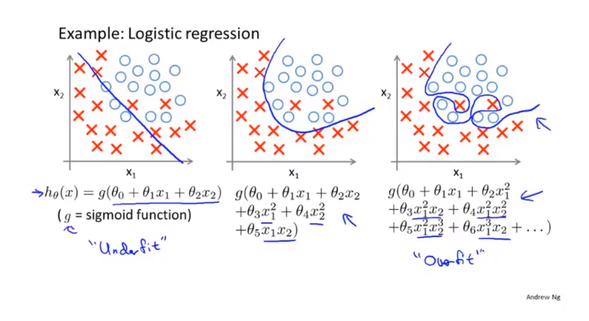
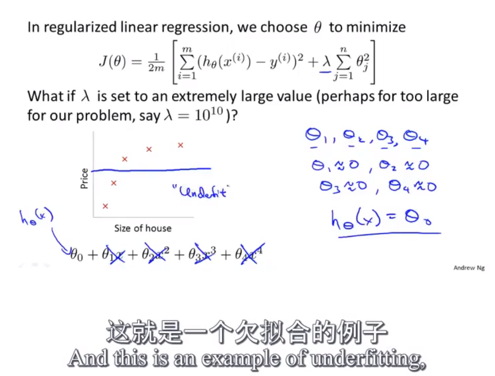
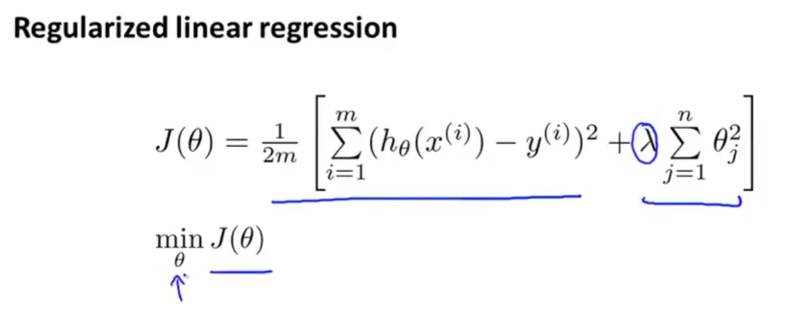
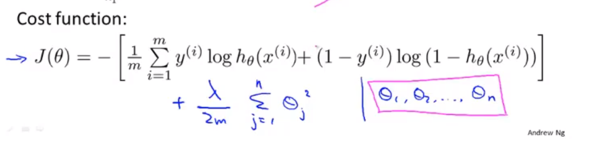
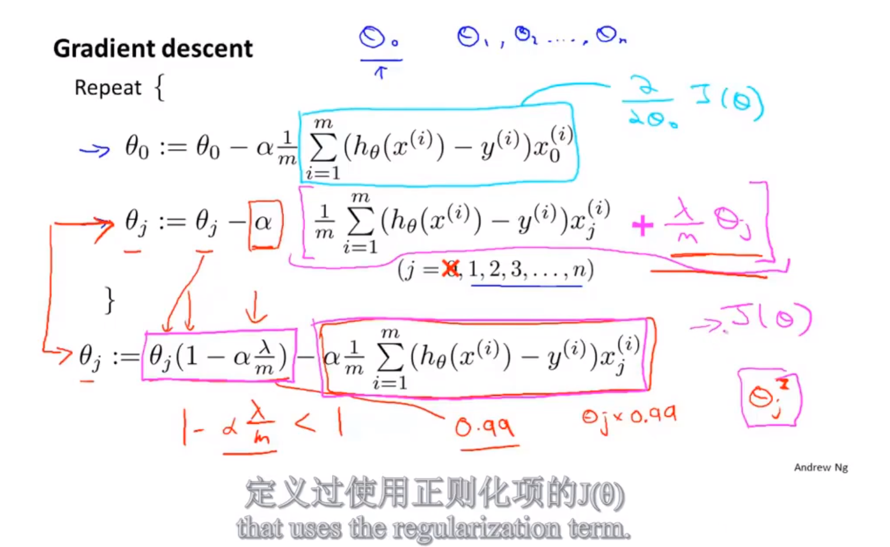
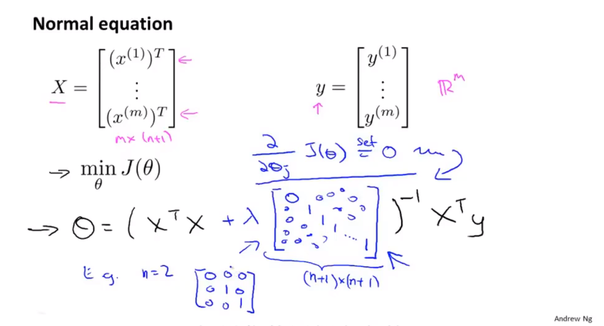
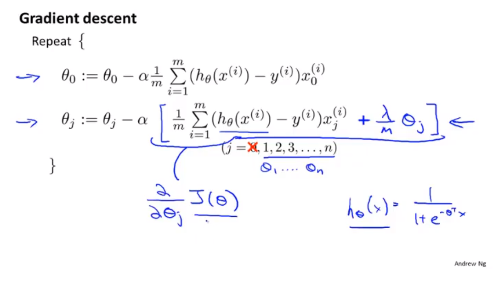
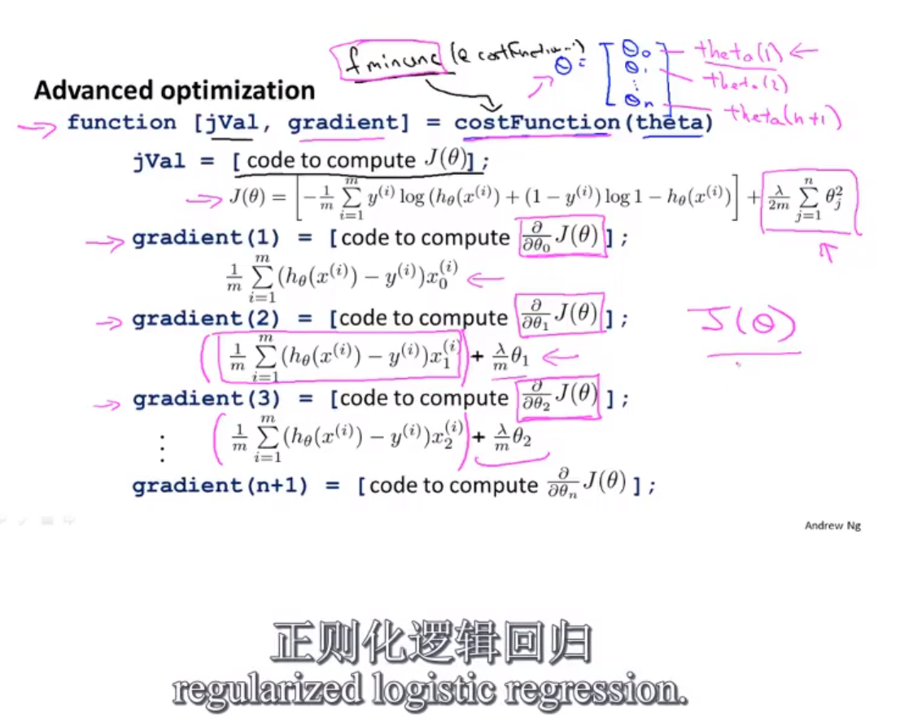

拟合问题

# 欠拟合, 拟合, 过拟合

## 欠拟合
    假设函数过于简单, Theta参数过少, 不能很好的拟合预测结果
    
## 过拟合
    Theta参数过多, 假设函数会过于接近训练数据, 缺乏对于新数据的预测能力

# 线性回归

# 逻辑回归

# 如何减少过拟合
    
    1. 减少不重要的特征(即减少特征X的数量(X1, X2...))
    2. 模型选择算法(后面章节讲)
    3. 保持特征不变, 减少Theta的量级(惩罚函数)
    
    
# 如果惩罚过多Theta参数, 可能会造成假设函数欠拟合

# 线性回归和逻辑回归

    1. 作用:
        线性回归: 线性拟合已有数据, 预测连续型结果
        逻辑回归: 将样本分类, 预测离散型结果

    2. 假设函数是  
        线性回归: 多元一次方程
        逻辑回归: sigmoid(多元多次方程)
    
    3. 代价函数
        线性回归:
        

        逻辑回归:
        

    4. 在梯度下降方法中, 都可以适用正规化来惩罚某些参数, 并且通过正规化后, 解决了X转置*X之后的矩阵不可逆的问题
        梯度下降过程:
        
        线性回归: 

        逻辑回归:

        