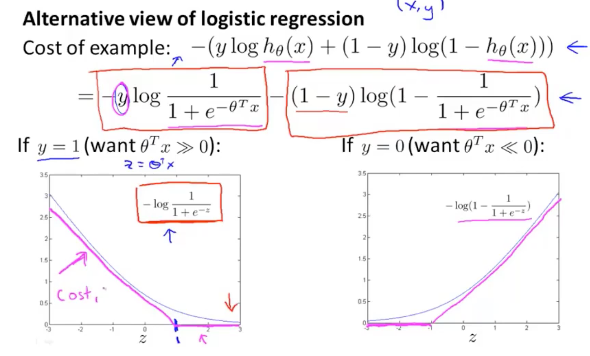
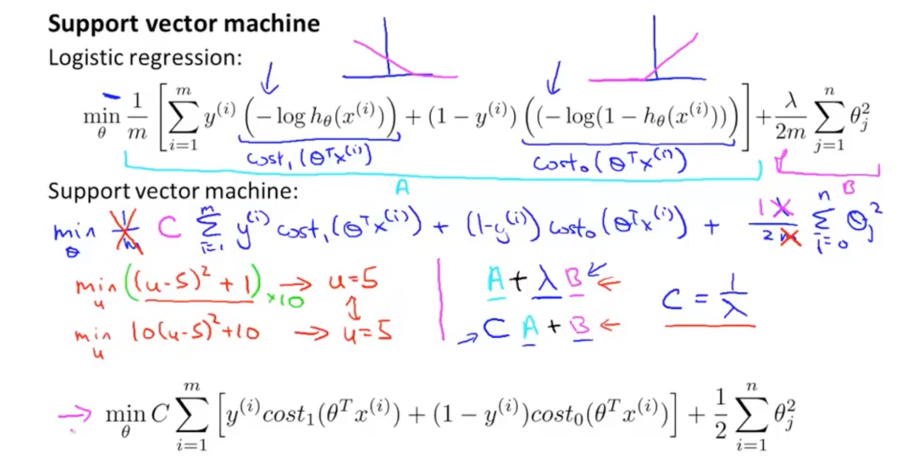
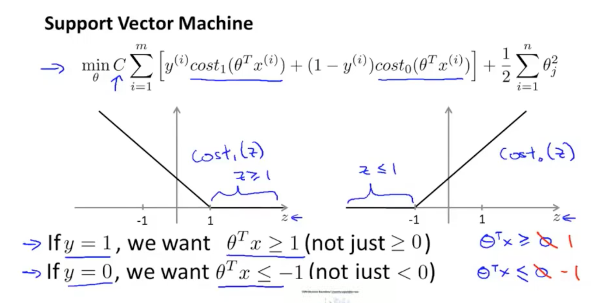
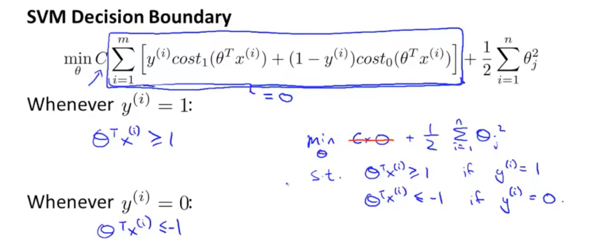
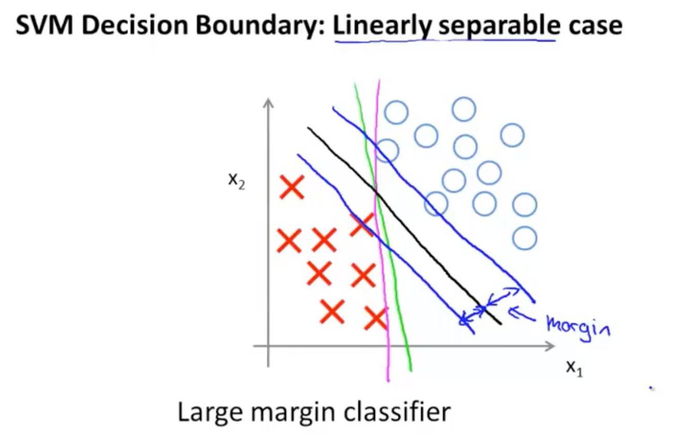
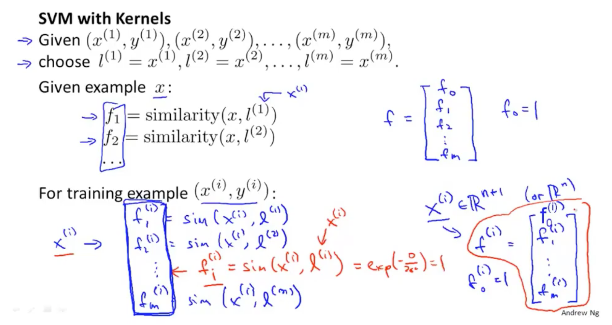
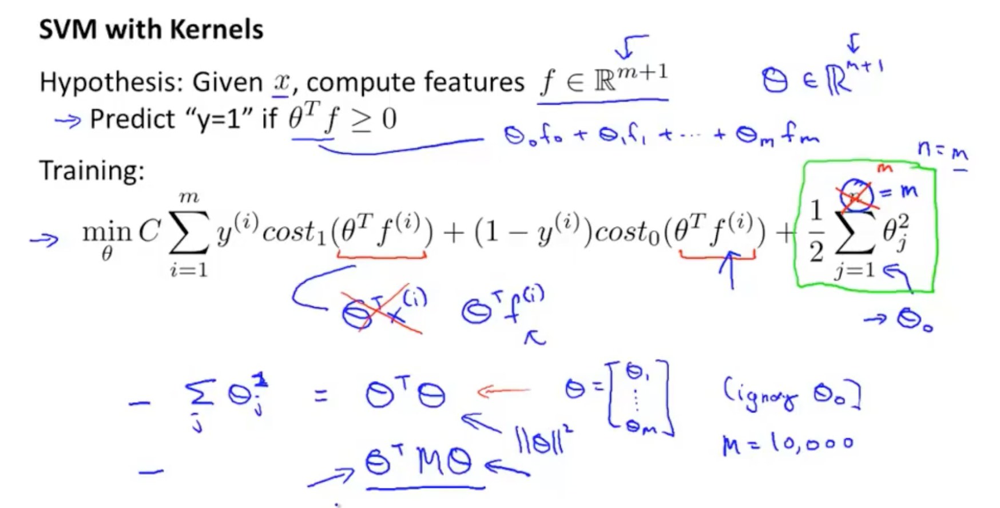

## P12 Support Vector Machine

SVM hypothesis:
$$
\underset{\theta}{min}C\sum_{i=1}^m[y^{(i)}cost_1(\theta^Tx^{(i)}) + (1-y^{(i)})cost_0(\theta^Tx^{(i)})] + \frac{1}{2}\sum_{i=1}^n\theta_j^2
$$

Hypothesis:
$$
h_{\theta}(x) = \begin{cases} 1, & \text {if $\theta^Tx \geq 0$} \\ 0, & \text{otherwise} \end{cases}
$$

 Kernels and Similarity

$f_1 = $ similarity($x, l^{(1)}$) = exp($-\frac{\lVert x-l^{(2)} \rVert}{2\sigma^2}$) = exp($-\frac{\sum_{j=1}^n (x_j - l_j^{(1)})^2}{2\sigma^2}$), 高斯核函数

if $x \approx l^{(1)}$ : $f_1 \approx 1$

if $x$ is far from $l^{(1)}$ : $f_1 \approx 0$

这个核函数衡量了$x$与标记$l$之间的距离，参数$\sigma$ 越大，从1到0变化越慢，$\sigma$ 越小，从1到0变化越大。

SVM和核函数技巧相得益彰，将核函数技巧应用于逻辑回归算法时，会变得很慢。

SVM parameters:

$C(=\frac{1}{\lambda})$ , Large C: lower bias, high variance. Small C: Higher bias, low variance.

$\sigma^2$ , Large $\sigma^2$ : Features $f_i$ vary more smoothly. Higher bias, lower variance. Small $\sigma^2$ :

Features $f_i$ vary less smoothly. Lower bias, higher variance.

使用第三方库SVM模型时，为训练参数$\theta$需要指定：C，核函数。

如果不需要核函数，核函数指定为linear kernel. 

如果指定高斯核函数时，需要选择$\sigma^2$ . 需要注意的是，如果特征变量大小不一，在应用高斯核前，需要将这些特征变量按大小比例归一化。

高斯核函数和线性核函数是最常用的核函数。

Logistic regression vs. SVMs:

n = number of features, m=number of training examples.

If n is large relative to m: Use logistic regression, or SVM without a kernel ("linear kernel")

If n is small, m is intermediate: Use SVM with Gaussian kernel. 比如m<10000。

If n is small, m is large: Create/add more features, then use logistic regression or SVM without a kernel. 比如m>50000, 用高斯核的SVM可能会很慢.
