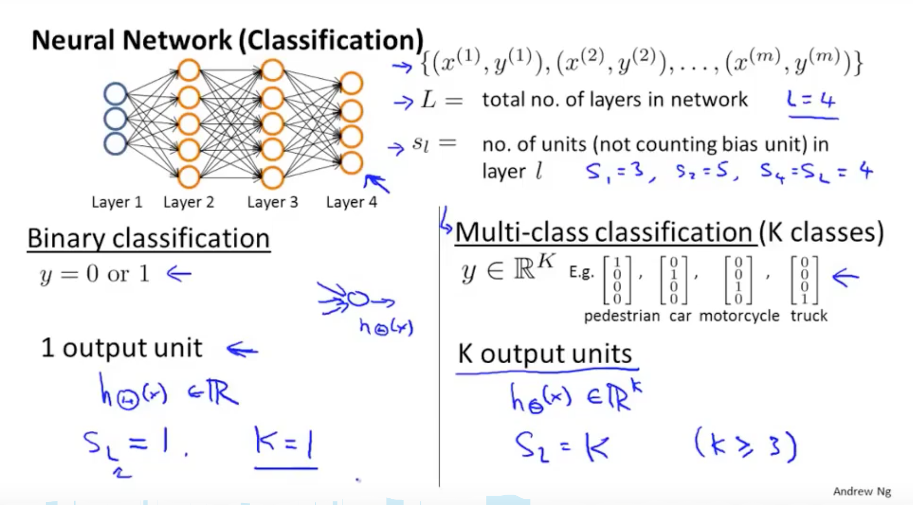
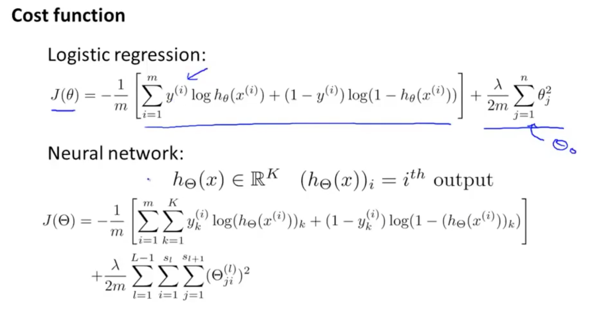
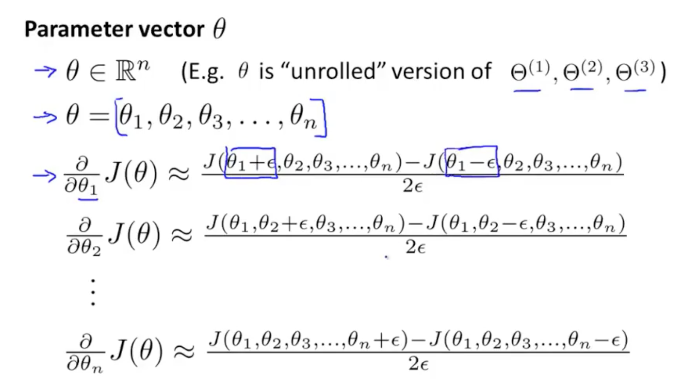
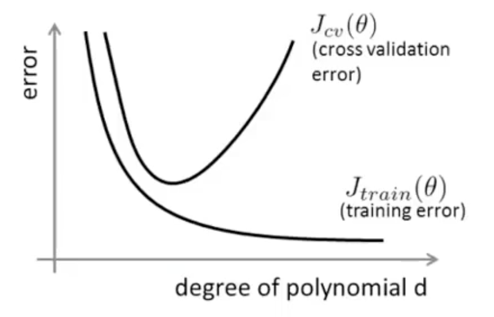
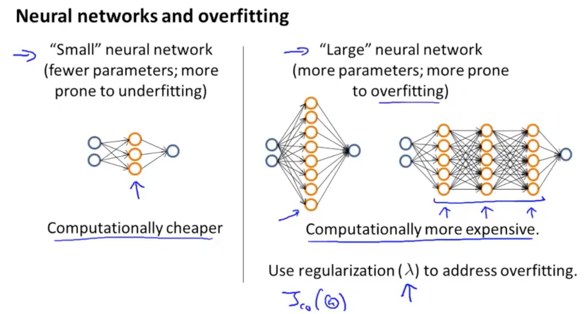

## P9.

一对多(one vs all)分类器

代价函数：

前向传播

反向传播

梯度检测:

初始化$\theta$参数:

如果把所有的$\theta$初始化为0，则每一次迭代和反向传播跌代后，权重仍然相同。

**Random initialization: Symmetry breaking**

Initialize each $\theta^{(l)}_{ij}$ to a random value in $[-\epsilon, \epsilon]$, (i.e. $-\epsilon \le \epsilon$) 

**Training a neural network**

Pick a network architecture：

No. of input units: Dimension of features $x^{(i)}$.

No. of output units: Number of classes.

Default: 1 hidden layer, or if > 1 hidden layer, have same no. of hidden units in every layer (usually the more the better). 通常隐藏层的神经元个数是输出层的1、2、3、4倍，数量太多的话，计算量太大。

1. Randomly initialize the weights.
2. Implement forward propagation to get $h_{(\theta)}(x^{(i)})$ for any $x^{(i)}$.
3. Implement code to compute cost function $J(\Theta)$.
4. Implement backprop to compute partial derivatives $\frac{\partial}{\partial\Theta^{(l)}_{jk}}J(\Theta)$.
5. Use gradient checking to compare  $\frac{\partial}{\partial\Theta^{(l)}_{jk}}J(\Theta)$ computed using backpropagation vs. using numerical estimate of gradient of $J(\Theta)$. Then disable gradient checking code.
6. Use gradient descent or advanced optimization method with backprogation to try to minimize $J(\Theta)$ as a function of parameters $\Theta$.

## P10

Machine learning diagnostic:

A test that you can run to gain insight what is/isn't working with a learning algorithm, and gain guidance as to how best to improve its performance.

将数据集随机拆分为training set, cross validation set和test set. training set用来训练模型，cross validation set用来选择模型, test set用来泛化误差。

这里的交叉验证与其他地方说的不太一样，比如10 Fold Cross Validation，将数据集分割为10份，9份用作训练，1份用作测试，然后再采集其他9份用作训练，一份用作测试，这样一共进行10次，所有的数据都参与了训练，也都参与了测试。

Diagnosing bias vs. variance:

例：

随着二次项系数次数增加，训练集的误差越来越小，但可能过拟合了，所以交叉验证的误差先变小又变大了。

Bias (underfit): $J_{train}(\theta)$ is high,  $J_{cv}(\theta) \approx J_{train}(\theta)$

Variance (overfit): $J_{train}(\theta)$ is low, $J_{cv}(\theta)  >> J_{train}(\theta)$

If a learning algorithm is suffering from high bias, getting more training data will not help much. It's the hypothesis model problem.

If a learning algorithm is suffering from high variance, getting more training data is likely to help.

当一个已经训练好的算法在新的数据集上有较大误差时，怎么办？

- Get more training examples: fix high variance

- Try smaller sets of features: fix high variance

- Try getting additional features: fix high bias

- Try adding polynomial features ($x_1^2, x_2^2, x_1x_2, etc$): fix high bias

- Try decreasing $\lambda$ : fix high bias

- Try increasing $\lambda$ : fix high variance

## P11

Recommended approach:

* Start with a simple algorithm that you can implement quickly. Implement it and test it on your cross-validation data.
* Plot learning curves to decide if more data, more features, etc. are likely to help.
* Error analysis: Manually examine the examples (in cross validation set) that your algorithm made errors on. See if you spot any systematic trend in what type of examples it is making errors on.

Precision/Recall:

|                   | Actual Class 1 | Actual Class 0 |
| ----------------- | -------------- | -------------- |
| Predicted Class 1 | True positive  | False positive |
| Predicted Class 0 | False negative | True negative  |

Precision = True positive / number of predicted positive = True positive / (True positive + False positive)

Recall = True positive / number of actual positive = True positive / (True positive + False negative)

Higher precision, lower recall. 

Higher recall, lower precision.

How to compare precision/recall numbers?

$F_1$ Score: $2 \frac{PR}{P+R}$

|             | Precision(P) | Recall(R) | $F_1$ Score |
| ----------- | :----------: | :-------: | :---------: |
| Algorithm 1 |     0.5      |    0.4    |    0.444    |
| Algorithm 2 |     0.7      |    0.1    |    0.175    |
| Algorithm 3 |     0.02     |    1.0    |   0.0392    |

