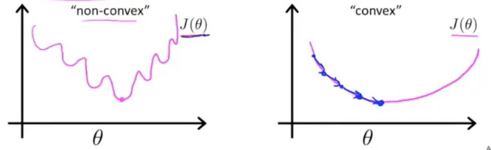

## P6. Logistic Regression 逻辑回归 | Classification

**广义线性回归**

 对数线性回归(log-linear regression)
$$
\ln y = wx+b 
$$

$$
y = e^{wx+b} = g(wx+b)
$$

函数$g$ 称为联系函数(link function)，它可以是任何单调可微函数。

这就是广义线性模型(generalized linear model)。


在监督学习中，除了回归问题，另一个主要问题是分类问题。


不推荐将线性回归（适合预测）应用于分类问题。

逻辑回归（logistic regression）算法的输出或预测值一直介于0和1之间，即：$0 \leq h_{\theta}(x) \leq 1$。

逻辑回归虽然叫回归（指示 预测），实际上是一种分类算法。

**Logistic Regression Model**:

want $0 \leq h_{\theta}(x) \leq 1$

线性回归时 $h_{\theta}(x) = \theta^{T}X$，为使$h_{\theta}(x)$满足上面的性质，将等号右边的结果进行包装修改为$g(\theta^{T}X)$

函数$g$可表示为$g(z) = \frac{1}{1+e^{-z}}$，即sigmoid函数，或叫logistic函数，对数几率函数。

$g(z) = \frac{1}{1+e^{-z}}$ —> $\ln \frac{g}{1-g} = z$

因此，

$$h_{\theta}(x)=\frac{1}{1 + e^{- \theta^T X}}$$

此时，$h_{\theta}(x)$的意义为$h_{\theta}(x) =$ estimated probability that $y=1$ on input $x$

```
# sigmoid 函数示例

import numpy as np
import matplotlib.pyplot as plt

x = np.linspace(-10, 10)
y = 1 / (1 + np.exp(-x))
plt.plot(x,y)
plt.show()
```

**Cost function:**

线性回归时的代价函数是：$J(\theta) = \frac{1}{m} \sum_{i=1}^{m} \frac{1}{2} (h_{\theta}(x^{(i)}) - y^{(i)})^2$

由于sigmoid函数是个复杂的非线性函数，代入上面的代价函数后是个非凸函数。



对于非凸函数应用**梯度下降算法**时，不能保证它能收敛到全局最小值。

所以，我们希望代价函数是个单弓形的凸函数。

这里不适合用梯度下降算法的原因中，还有sigmoid函数在饱和区梯度变化很小，导致收敛很慢。

所以在逻辑回归中，我们通常使用**交叉熵损失函数(Cross Entropy)**来代替平方损失函数：

重新定义代价函数为:  

$$J(\theta) = \frac{1}{m} \sum_{i=1}^{m} Cost(h_{\theta}(x), y)$$

$$Cost(h_{\theta}(x), y) = \begin{cases} -\log(h_{\theta}(x)), & \text{if y=1} \\ -\log(1-h_{\theta}(x)), & \text{if y=0} \end{cases}$$

现在代价函数是一个凸函数了，通常也写成：

$$Cost(h_{\theta}(x), y) = -y \log(h_{\theta}(x)) - (1-y) \log(1-h_{\theta}(x))$$

**交叉熵损失函数(Cross Entropy)**:

$$J(\theta) = - \frac{1}{m} \sum_{i=1}^{m} \left[ y^{(i)} \log(h_{\theta}(x^{(i)})) + (1-y^{(i)})\log(1-h_{\theta}(x^{(i)})) \right]$$

```
# 代价函数的代码实现
import numpy as np


x = np.random.randint(5, size=(3, 4))
y = np.random.randint(5, size=(3, 1))
m = x.shape[0] # 样本数量
theta = np.random.randint(5, size=(1, 4))

def sigmoid(x):
    return 1/(1+np.exp(-x))

def cost_j(theta):
    tmp = 0
    for i in range(m):
        tmp += y[i] * np.log10(sigmoid(np.dot(theta, x[i,:]))) + (1 - y[i]) * np.log10(1 - sigmoid(np.dot(theta, x[i,:])))
    return -1 * tmp / m

print(cost_j(theta))
```

**Gradient Descent:**
want $min_{\theta}J(\theta)$:

Repeat {

$$
\begin{equation}
\begin{aligned}
\theta_j &:= \theta_j - \alpha \frac{\partial}{\partial \theta_j}J(\theta) \\
&:= \theta_j - \alpha \sum_{i=1}^{m}(h_{\theta}(x^{(i)}) - y^{(i)}) x_j^{(i)}
\end{aligned}
\end{equation}
$$

 } (simultaneously update all $\theta_j$)

看起来与线性回归中的梯度下降的公式一样，不一样的是在线性回归中$h_{\theta}(x) = \theta^T x$，而在逻辑回归中$h_{\theta}(x) = \frac{1}{1+e^{-\theta^T x}}$。


上式具体推导过程如下：
$$
\begin{equation}
\begin{aligned}
\theta_j &:= \theta_j - \alpha \frac{\partial}{\partial \theta_j}J(\theta) \\
&:= \theta_j - \alpha \frac{\partial}{\partial \theta_j} \lbrace - \frac{1}{m} \sum_{i=1}^{m} \left[ y^{(i)} \log(h_{\theta}(x^{(i)})) + (1-y^{(i)})\log(1-h_{\theta}(x^{(i)})) \right] \rbrace \\
&:= \theta_j - \alpha \lbrace - \frac{1}{m} \sum_{i=1}^{m} \left[ y^{(i)} \cdot \frac{1}{h_{\theta}(x^{(i)}) \ln 10} \cdot \frac{\partial}{\partial \theta_j} h_{\theta}(x^{(i)}) + (1-y^{(i)}) \cdot \frac{1}{(1-h_{\theta}(x^{(i)})) \ln 10}  \cdot \frac{\partial}{\partial \theta_j} (1-h_{\theta}(x^{(i)})) \right] \rbrace \\ 
&:= \theta_j - \alpha \lbrace - \frac{1}{m} \sum_{i=1}^{m} \left[ \frac{y^{(i)} (1-h_{\theta}(x^{(i)})) - h_{\theta}(x^{(i)}) (1-y^{(i)})}{h_{\theta}(x^{(i)}) (1-h_{\theta}(x^{(i)})) \ln 10} \cdot \frac{\partial}{\partial \theta_j} h_{\theta}(x^{(i)}) \right] \rbrace \\
&:=  \theta_j - \alpha \lbrace - \frac{1}{m} \sum_{i=1}^{m} \frac{y^{(i)}-y^{(i)}h_{\theta}(x^{(i)})-h_{\theta}(x^{(i)})+y^{(i)}h_{\theta}(x^{(i)})}{h_{\theta}(x^{(i)})(1-h_{\theta}(x^{(i)})) \ln10} \cdot \frac{\partial}{\partial \theta_j} h_{\theta}(x^{(i)}) \rbrace \\
&:=  \theta_j - \alpha \lbrace - \frac{1}{m} \sum_{i=1}^{m} \frac{y^{(i)}-h_{\theta}(x^{(i)})}{h_{\theta}(x^{(i)})(1-h_{\theta}(x^{(i)})) \ln10} \cdot \frac{\partial}{\partial \theta_j} h_{\theta}(x^{(i)}) \rbrace \\
&:= \theta_j - \alpha \lbrace - \frac{1}{m} \sum_{i=1}^{m} \frac{y^{(i)}-h_{\theta}(x^{(i)})}{h_{\theta}(x^{(i)})(1-h_{\theta}(x^{(i)})) \ln10} \cdot \frac{\partial}{\partial \theta_j} \frac{1}{1+e^{-\theta_j x_i}} \rbrace \\
&:=  \theta_j - \alpha \lbrace - \frac{1}{m} \sum_{i=1}^{m} \frac{y^{(i)}-h_{\theta}(x^{(i)})}{h_{\theta}(x^{(i)})(1-h_{\theta}(x^{(i)})) \ln10} \cdot -1 \cdot \frac{1}{(1+e^{-\theta_j x_i})^2} \cdot e^{-\theta_j x_i} \cdot -x_i \rbrace \\
&:=  \theta_j - \alpha \lbrace \frac{1}{m} \sum_{i=1}^{m} \frac{(h_{\theta}(x^{(i)})-y^{(i)}) x_i}{h_{\theta}(x^{(i)})(1-h_{\theta}(x^{(i)})) \ln10} \cdot \frac{1}{(1+e^{-\theta_j x_i})^2} \cdot e^{-\theta_j x_i} \rbrace \\
\end{aligned}
\end{equation}
$$

由于sigmoid函数$g$的导数等于$g(1-g)$，所以上式中：

$$
\begin{equation}
\begin{aligned}
h_{\theta}(x^{(i)})(1-h_{\theta}(x^{(i)})) &= \frac{1}{1+e^{-\theta_jx_i}} \cdot \frac{1+e^{-\theta_j x_i}-1}{1+e^{-\theta_jx_i}} \\
&= \frac{e^{-\theta_j x_i}}{(1+e^{-\theta_jx_i})^2} \\
\end{aligned}
\end{equation}
$$

所以，

$$
\begin{equation}
\begin{aligned}
\theta_j &:= \theta_j - \alpha \lbrace \frac{1}{m} \sum_{i=1}^{m} \frac{(h_{\theta}(x^{(i)})-y^{(i)}) x_i}{\ln10} \rbrace \\
即 &:= \theta_j - \alpha \sum_{i=1}^{m} (h_{\theta}(x^{(i)})-y^{(i)}) x_i \\
\end{aligned}
\end{equation}
$$

```
# 梯度下降代码实现
import numpy as np


x = np.random.randint(5, size=(3, 4))
y = np.random.randint(5, size=(3, 1))
m = x.shape[0] # 样本数量
theta = np.random.random(size=(1, 4))
alpha = 0.003

def sigmoid(x):
    return 1/(1+np.exp(-x))

def gradient_descent(theta):
    tmp = 0
    for i in range(m):
        tmp += sigmoid(np.dot(theta, x[i,:]) - y[i]) * x[i,:]
    theta -= alpha * tmp
    return theta
    
print(gradient_descent(theta))
```

**Optimization Algorithm:**

除了梯度下降算法外，还可以用其他更高级算法来进行代价函数最小化, $min_{\theta}J(\theta)$，比如共轭梯度算法（Conjugate gradient）、 BFGS、L-BFGS算法等。

这三个算法的优点是：
* 不需要手动设置学习速率$\alpha$
* 一般比梯度下降算法更快

缺点是：
* 比梯度下降算法更复杂

除非你是数值计算的专家，最好不要自己去实现这三个算法，直接使用第三方库。

**多分类问题**

逻辑回归是二分类算法，对多分类问题：

输出编码：

* 自然顺序码

  0， 1， 2

  因为编码存在大小，尤其对于欧氏距离运算，可能在学习过程中造成偏差

* 独热编码(One-Hot Encoding)

  一个向量中只有一个元素为1，其他都为0.

  (1, 0, 0), (0, 1, 0), (0, 0, 1)

  使非偏序关系的数据，取值不具有偏序性

  到原点等距 

* 独冷编码(one hot)

  一个向量中只有一个元素为0，其他都为1

  (0, 1, 1), (1, 0, 1), (1, 1, 0)

**sigmoid函数 vs softmax算法**

在二分类问题中，通过sigmoid函数计算每个标签的概率，而在多分类问题中，应用softmax算法替代sigmoid函数来计算每个标签的概率，相当于二分类问题向多分类问题的推广。

在二分类问题中，我们使用交叉熵作为代价函数，在多分类中，也可以拓展使用交叉熵作为代价函数。

**交叉熵代价函数**

二分类交叉熵代价函数：

$$J(\theta) = - \frac{1}{m} \sum_{i=1}^{m} \left[ y^{(i)} \log(h_{\theta}(x^{(i)})) + (1-y^{(i)})\log(1-h_{\theta}(x^{(i)})) \right]$$

多分类交叉熵代价函数：

$$J(\theta) = - \frac{1}{m} \sum_{i=1}^{m} \sum_{j=1}^n y_j^{(i)} \log(h_{j\theta}(x^{(i)})) $$

m:样本总数，n:类别总数

**分类问题**

互斥的多分类问题：每个样本只能够属于一个类别

非互斥的多分类问题：一个样本可以同时属于多个类别