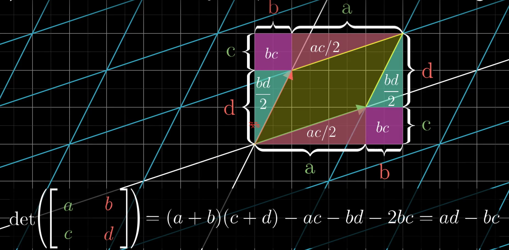
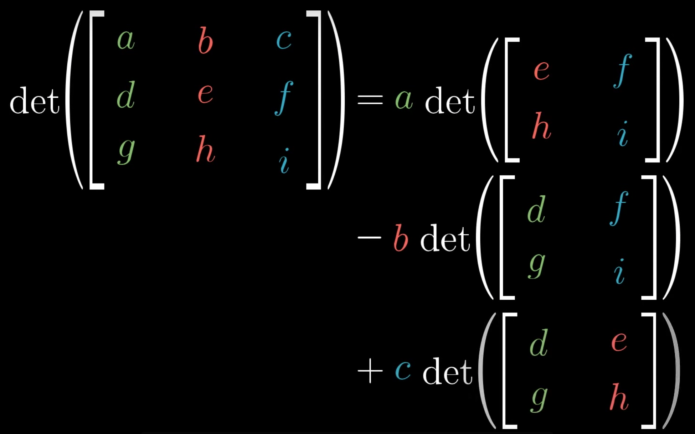
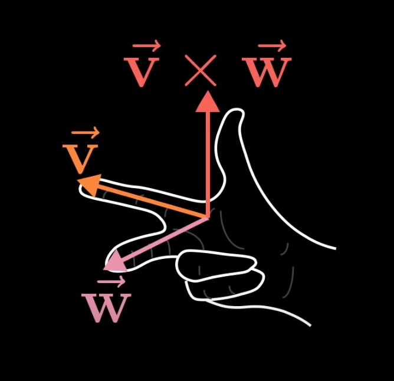

# Interesting Math

# Contents

- [Linear Algebra](#Linear-Algebra)
    - [Preface](#Preface)
    - [Linear transformation](#Linear-transformation)
    - [Matrix multiplication as composition](#Matrix-multiplication-as-composition)
    - [Three-dimensional linear transformations](#Three-dimensional-linear-transformations)
    - [The determinant](#The-determinant)
    - [Inverse matrices, column space and null sapce](#Inverse-matrices,-column-space-and-null-sapce)
    - [Reference](#Reference)

# Linear Algebra

## Preface

There is fundamental difference between understanding linear algebra on _numerical level_ and understanding it on _geometric level_.
- The geometric understanding lets you judge what tools to use to solve specific problems, feel why they work, and know how to interpret the results.
- The numerical understaning lets you carry through the applications of those tools.  

The linear algrbra gives the data analyst a nice way to conceptualise many lists of numbers in a visual way, which can seriously clarify patterns in data, and give a globally view of what certain operations do, and on the flip side, it gives people like physicist and computer graphics programmers a language to describe space and the manipulation of space using numbers that can be crunched and run through a computer.   

## Linear transformation 线性变换

Linear algebra limits itself to a special transformation. Visually speaking, a transformation is linear if it has two properties: __all lines must remain lines, without getting curved, and the origin must remain the fixed place__. Or generally speaking, grid lines remain parallel and evenly spaced.

For example, given a random matrix $\begin{bmatrix} 1 & 3 \\ 2 & 1 \end{bmatrix}$, which denotes the transformed basis vectors' coordinates $\vec{i} = \begin{bmatrix} 1\\2 \end{bmatrix}$, $\vec{j}= \begin{bmatrix} 3\\1 \end{bmatrix}$, then given a random vector $\begin{bmatrix} 6\\7 \end{bmatrix}$, whose transformed new vector will be $$\begin{bmatrix} 1&3\\2&1 \end{bmatrix} \begin{bmatrix} 6\\7 \end{bmatrix}=6\begin{bmatrix}1\\2 \end{bmatrix}+7\begin{bmatrix}3\\1 \end{bmatrix}=\begin{bmatrix}27\\19 \end{bmatrix}$$

Technically speaking, linear transformations are functions, with vectors are inputs, and vectors are outputs. The above example can also be described as   

$$
f\left( \begin{bmatrix}6\\7 \end{bmatrix} \right)=
\begin{bmatrix} 1&3\\2&1 \end{bmatrix}
\begin{bmatrix} 6\\7 \end{bmatrix}=
6\begin{bmatrix}1\\2 \end{bmatrix}+
7\begin{bmatrix}3\\1 \end{bmatrix}=
\begin{bmatrix}27\\19 \end{bmatrix}
$$

## Matrix multiplication as composition

"Composition" of a rotation and a shear

$$
\underbrace{\begin{bmatrix} 1 & 1\\ 0 & 1 \end{bmatrix}}_{\text{Shear}} 
\left(\underbrace{\begin{bmatrix}0&-1\\1&0 \end{bmatrix}}_{\text{Rotation}}
\begin{bmatrix}x\\y \end{bmatrix}\right)
=\underbrace{\begin{bmatrix}1&-1\\1&0 \end{bmatrix}}_{\text{Composition}} 
\begin{bmatrix}x\\y \end{bmatrix}
$$

where the matrix "Composition" can be seen as a "product" of the original matrices. It's the final linear transformation, as the total effect of two transformations.  

$$
\underbrace{\begin{bmatrix} 1 & 1\\ 0 & 1 \end{bmatrix}}_{\text{Shear}} 
\underbrace{\begin{bmatrix}0&-1\\1&0 \end{bmatrix}}_{\text{Rotation}}
=\underbrace{\begin{bmatrix}1&-1\\1&0 \end{bmatrix}}_{\text{Composition}} 
$$

Always remember, the mutilpilying two matrices like this has the geometric meaning of applying one transformation then another.  

One thing that's kinda weird here, is that this has reading from right to left, you first apply the transformation represented by the matrix on the right, then you apply the transformation represented by the metrix on the left.

$$
\overbrace{
\overleftarrow{
\underbrace{\begin{bmatrix} 1 & 1\\ 0 & 1 \end{bmatrix}}_{\text{Shear}} 
\underbrace{\begin{bmatrix}0&-1\\1&0 \end{bmatrix}}_{\text{Rotation}}
}
}^{f(g(x))}
=\underbrace{\begin{bmatrix}1&-1\\1&0 \end{bmatrix}}_{\text{Composition}} 
$$

This stems from funtion notation, since we write functions on the left of variables, so every time you compose two functions, you always have to read it from right to left.  

How to find the new transformation based on the given transformations? For example, $M_1=\begin{bmatrix}1&-2\\1&0\\ \end{bmatrix}$, $M_2=\begin{bmatrix}0&2\\1&0 \end{bmatrix}$.  

$$
\overbrace{
\begin{bmatrix}0&2\\1&0 \end{bmatrix}
}^{M_2}
\overbrace{
\begin{bmatrix}1&-2\\1&0 \end{bmatrix}
}^{M_1}
=\begin{bmatrix}?&?\\?&? \end{bmatrix}
$$

First, we need to figure out where i-hat goes. After applying $M_1$, the new coordinates of i-hat, by definition, are given by the first column of $M_1$, namely $\begin{bmatrix}1\\1\\ \end{bmatrix}$. To see what happens after applying $M_2$, multiply the matrix $M_2$ by that vector $\begin{bmatrix}1\\1\\ \end{bmatrix}$. Working it out, you would get vector $\begin{bmatrix}2\\1\end{bmatrix}$. This would be the first column of the composition matrix. 

$$
\begin{bmatrix}0&2\\1&0 \end{bmatrix}
\begin{bmatrix}1\\1 \end{bmatrix}=
1\begin{bmatrix}0\\1 \end{bmatrix}+
1\begin{bmatrix}2\\0 \end{bmatrix}=
\begin{bmatrix}2\\1 \end{bmatrix}
$$

Likewise, to follow j-hat, the second column of $M_1$ tells us the first lands on $\begin{bmatrix}-2\\0\end{bmatrix}$. Then, we apply $M_2$ to that vector, you can work out the matrix-vector product to get $\begin{bmatrix}0\\-2\end{bmatrix}$:  

$$
\begin{bmatrix}0&2\\1&0 \end{bmatrix}
\begin{bmatrix}-2\\0 \end{bmatrix}=
-2\begin{bmatrix}0\\1\end{bmatrix}+
0\begin{bmatrix}2\\0\end{bmatrix}=
\begin{bmatrix}0\\-2\end{bmatrix}
$$

So, the final transformation is:

$$
\begin{bmatrix}0&2\\1&0 \end{bmatrix}
\begin{bmatrix}1&-2\\1&0 \end{bmatrix}=
\begin{bmatrix}2&0\\1&-2\end{bmatrix}
$$

This method works generally. Try it again! 

$$
\overbrace{
\begin{bmatrix}a&b\\c&d \end{bmatrix}
}^{M_2}
\overbrace{
\begin{bmatrix}e&f\\g&h \end{bmatrix}
}^{M_1}
=\begin{bmatrix}?&?\\?&? \end{bmatrix}
$$

To follow where i-hat goes, start by looking at the first column of the matrix on the right $\begin{bmatrix}e\\g\end{bmatrix}$, since this is where i-hat initially lands. Multiplying that column by the matrix on the left, is how you can tell where the intermediate version of i-hat ends up after applying the second transformation.So the first column of the first composition matrix will always equal the first matrix times the firt column of the right matrix. 

$$
\begin{bmatrix}a&b\\c&d\end{bmatrix}
\begin{bmatrix}e\\g\end{bmatrix}=
e\begin{bmatrix}a\\c\end{bmatrix}+
g\begin{bmatrix}b\\d\end{bmatrix}=
\begin{bmatrix}ae+bg\\ce+dg\end{bmatrix}
$$

Likewise, j-hat will always initially land on the second column of the right matrix $\begin{bmatrix}f\\h\end{bmatrix}$. So multiplying the first matrix by this second column will give its final location, and hence that's the second column of the composition matrix.  

$$
\begin{bmatrix}a&b\\c&d\end{bmatrix}
\begin{bmatrix}f\\h\end{bmatrix}=
f\begin{bmatrix}a\\c\end{bmatrix}+
h\begin{bmatrix}b\\d\end{bmatrix}=
\begin{bmatrix}af+bh\\cf+dh\end{bmatrix}
$$

So, the final result is:

$$
\begin{bmatrix}a&b\\c&d\end{bmatrix}
\begin{bmatrix}e&f\\g&h\end{bmatrix}=
\begin{bmatrix}ae+bg & af+bh \\ ce+dg &(cf+dh) \end{bmatrix}
$$

The order of two transformations totally does matter! That says $M_1M_2\neq M_2M_1$.

In another case, $A(BC)=(AB)C$. It's saying that if you first apply C then B, then A, it's the same as applying C, then B then A. The order of transformations is the same.  

## Three-dimensional linear transformations

For example,

$$
\underbrace{\begin{bmatrix}0&1&2\\3&4&5\\6&7&8\end{bmatrix}}_{\text{Transformation}}
\overbrace{\begin{bmatrix}x\\y\\z\end{bmatrix}}^{\text{Input vector}}=
\underbrace{
x\begin{bmatrix}0\\3\\6\end{bmatrix}+
y\begin{bmatrix}1\\4\\7\end{bmatrix}+
z\begin{bmatrix}2\\5\\8\end{bmatrix}
}_{\text{Output vector}}
$$

Multiplying two transformations is also similar. Whenever you see two 3x3 matrices getting multiplied together, you should image first applying the transformation encoded by the right one, then applying the transformation encoded by the left one. Performing this matrix mutiplication numerically is pretty similar to the two-dimensional case. For example:

$$
\overbrace{
\begin{bmatrix}0&-2&2\\5&1&5\\1&4&-1\end{bmatrix}
}^{\text{Second tranformation}}
\underbrace{
\begin{bmatrix}0&1&2\\3&4&5\\6&7&8\end{bmatrix}
}_{\text{First transformation}}
$$

First, follow where i-hat goes:

$$
\begin{bmatrix}0&-2&2\\5&1&5\\1&4&-1\end{bmatrix}
\begin{bmatrix}0\\3\\6\end{bmatrix}=
0\begin{bmatrix}0\\5\\1\end{bmatrix}+
3\begin{bmatrix}-2\\1\\4\end{bmatrix}+
6\begin{bmatrix}2\\5\\-1\end{bmatrix}=
\begin{bmatrix}6\\33\\6\end{bmatrix}
$$

Then, follow where j-hat goes:

$$
\begin{bmatrix}0&-2&2\\5&1&5\\1&4&-1\end{bmatrix}
\begin{bmatrix}1\\4\\7\end{bmatrix}=
1\begin{bmatrix}0\\5\\1\end{bmatrix}+
4\begin{bmatrix}-2\\1\\4\end{bmatrix}+
7\begin{bmatrix}2\\5\\-1\end{bmatrix}=
\begin{bmatrix}6\\44\\10\end{bmatrix}
$$

At last, follw where k-hat goes:

$$
\begin{bmatrix}0&-2&2\\5&1&5\\1&4&-1\end{bmatrix}
\begin{bmatrix}2\\5\\8\end{bmatrix}=
2\begin{bmatrix}0\\5\\1\end{bmatrix}+
5\begin{bmatrix}-2\\1\\4\end{bmatrix}+
8\begin{bmatrix}2\\5\\-1\end{bmatrix}=
\begin{bmatrix}6\\55\\14\end{bmatrix}
$$

So, the final transformation is:

$$
\begin{bmatrix}0&-2&2\\5&1&5\\1&4&-1\end{bmatrix}
\begin{bmatrix}0&1&2\\3&4&5\\6&7&8\end{bmatrix}=
\begin{bmatrix}6&6&6\\33&14&55\\6&10&14\end{bmatrix}
$$

## The determinant 行列式

One thing that turns out to be pretty useful to understand linear transformation is to measure exactly how much it stretches or squishes things. More specifically, to measure the factor by which the given region increases or decreases.  
For example, given matrix $\begin{bmatrix}3&0\\0&2\end{bmatrix}$, how much is __area__  scaled after transformation? 
Since the region started out with area 1, ended up with area 6, we can say that the liear transformation has scaled its area by a factor of 6.  
If you know how much the area of one single unit square changes, it can tell you how any possible region in space changes. This very special scaling factor by which a linear transformation changes any area, is called the _determinant_ of the transformation.

$$
det\left(\begin{bmatrix}3&2\\0&2\end{bmatrix}\right)=6
$$

Below image illustrates the determinant of geometic meaning:

But, what would scaling an area by a negative amount even mean?
For example, $det\left(\begin{bmatrix}1&2\\3&4\end{bmatrix}\right)=-2$. This has to do with the idea of orientation, which feels like flipping space. Any transformations that do this are said to "invert the orientation of space".  
Determinant of 3x3 matrix tells you how much volume get scaled.

The determinant of the resulting matrix is the same as the product of the determinants of the original two matirces. $det(M_1M_2)=det(M_1)det(M_2)$

矩阵点乘也是矩阵空间线性变换的一种形式。

两个向量的叉乘 = 两个向量所围成的平行四边形的面积，即 $\vec{v} \times \vec{w} = -\vec{w} \times \vec{v} = Area \quad of \quad parallelogram$

结果也可能是负值，负值则代表了向量所在的空间发生了翻转。 

两个向量的叉乘可以用矩阵的**行列式**来计算，因为行列式就是变换前后面积变化比例的度量。

比如$\vec{v} = \begin{bmatrix} 3 \\ 1 \end{bmatrix}$, $\vec{w} = \begin{bmatrix} 2 \\ -1 \end{bmatrix}$, 将向量$\vec{v}$作为矩阵的第一列，向量$\vec{w}$作为矩阵的第二列，即 $\begin{bmatrix} 3 & 2 \\ 1 & -1 \end{bmatrix}$, 那么, 

$$
\vec{v} \times \vec{w} = det \left( \begin{bmatrix} 3 & 2 \\ 1 & -1 \end{bmatrix} \right) = \begin{vmatrix} 3 & 2 \\ 1 & -1 \end{vmatrix} = -3 \cdot 1 + 2 \cdot 1 = -5
$$

当两个向量的方向垂直时，此时的面积最大；当两个向量的方向相近时，此时的面积最小。放大其中一个向量3倍，则其面积也是变为3倍，即 $(3\vec{v}) \times \vec{w} = 3(\vec{v}\times\vec{w})$。

实际上，两个向量的叉乘的结果也是一个向量，即$\vec{v} \times \vec{w} = \vec{p}$, 向量$\vec{p}$的大小是向量$\vec{v}$和向量$\vec{w}$所围成的平行四边形的面积，$\vec{p}$的方向与平行四边形所在的平面垂直，如图所示。

对于3维的向量的叉乘的计算，如下所示：

$$
\begin{bmatrix} v_1 \\ v_2 \\ v_3 \end{bmatrix} \times \begin{bmatrix} w_1 \\ w_2 \\ w_3 \end{bmatrix} = det \left( \begin{bmatrix} \hat{i} & v_1 & w_1 \\ \hat{j} & v_2 & w_2 \\ \hat{k} v_3 & w_3 \end{bmatrix}\right) = \hat{i}(v_2 w_3 - v_3 w_2) - \hat{j}(v_1 w_3 - V_3 w_1) + \hat{k}(v_1 w_2 - v_2 w_1)
$$

其中，$\hat{i}, \hat{j}, \hat{k}$为基向量。

## Cramer's rule

## Inverse matrices, column space and null sapce

Linear system of equations. You might notice that this looks a lot like matrix-vector multiplication. In fact, you can package all of the equations together into a single vector equation, where you have the matrix containing all of the constant coefficients, and a vector containing all of the variables, and their matrix-vector product equals some different constant vector.

$$
\begin{cases}
2x+5y+3z=-3\\
4x+0y+8z=0\\
1x+3y+0z=2
\end{cases}
\longrightarrow
\overbrace{
\underbrace{
\begin{bmatrix}2&5&3\\
4&0&8\\
1&3&0
\end{bmatrix}
}_{\text{Coefficients}}
}^{A}
\overbrace{
\underbrace{
\begin{bmatrix}x\\
y\\
z
\end{bmatrix}
}_{\text{Variables}}
}^{\overrightarrow{X}}=
\overbrace{
\underbrace{
\begin{bmatrix}-3\\
0\\
2
\end{bmatrix}
}_{\text{Constants}}
}^{\overrightarrow{V}}
\longrightarrow
\underbrace{A}_{Transformation}
\overrightarrow{X}=\overrightarrow{V}
$$

jixingIt sheds light on a pretty cool geometic interpretation for the problem. The matrix $A$ corresponds with some linear transformation, so solving $AX=V$ means we are looking for a vector $X$, which after applying the transformation, lands on $V$.

## Reference
   1. [Essence of Linear Algebra][https://www.youtube.com/watch?v=kjBOesZCoqc&amp;amp;amp;list=PLZHQObOWTQDPD3MizzM2xVFitgF8hE_ab].